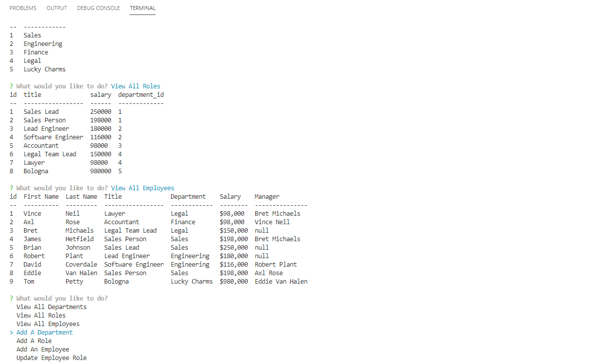

 

# employee-tracker-sql
 Node Inquirer app to view and manage the departments, roles, and employees in a company so that you can organize and plan your business.

# Table of Contents 

* [Technology used](#Technology%20used)
* [Installation](#Installation)
* [Usage](#Usage)
* [License](#License)

# Technology used

* Node
* npm
* inquirer
* console.table
* SQL
* MySQL Workbench

# Installation 

From the command line change directory to where you cloned this repo to then type 'npm install', then to run it type 'node employeeTracker.js'

# Usage
Check out my [video tutorial]( https://drive.google.com/file/d/1ipxTHQaCM2ZmK6PvqwCKg5Y_Kmngwc5k/view) for a complete walkthrough of this app.

All required functionality includes
    * View All Departments
    * View All Roles
    * View All Employees
    * Add Role
    * Add Department
    * Add Employee
    * Remove Employee

Using the above questions you can add the command-line application will allow you to add departments, roles and employees, view departments, roles, and employees and Update employee roles.  Viewing all employees will return the full dataset of id, First Name, Last Name, Title, Department, Salary and Manager.

# License
MIT License

Copyright (c) 2021 JodyBrzo

Permission is hereby granted, free of charge, to any person obtaining a copy 
of this software and associated documentation files (the "Software"), to deal
in the Software without restriction, including without limitation the rights
to use, copy, modify, merge, publish, distribute, sublicense, and/or sell
copies of the Software, and to permit persons to whom the Software is
furnished to do so, subject to the following conditions:

The above copyright notice and this permission notice shall be included in all
copies or substantial portions of the Software.

THE SOFTWARE IS PROVIDED "AS IS", WITHOUT WARRANTY OF ANY KIND, EXPRESS OR
IMPLIED, INCLUDING BUT NOT LIMITED TO THE WARRANTIES OF MERCHANTABILITY,
FITNESS FOR A PARTICULAR PURPOSE AND NONINFRINGEMENT. IN NO EVENT SHALL THE
AUTHORS OR COPYRIGHT HOLDERS BE LIABLE FOR ANY CLAIM, DAMAGES OR OTHER
LIABILITY, WHETHER IN AN ACTION OF CONTRACT, TORT OR OTHERWISE, ARISING FROM,
OUT OF OR IN CONNECTION WITH THE SOFTWARE OR THE USE OR OTHER DEALINGS IN THE
SOFTWARE.

